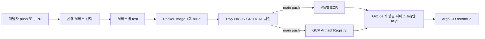

# Phase 1 애플리케이션 CI

## 검증 범위와 결론

이 문서는 구현 예정안이 아니라 2026-09-02 KST에 실제 GitHub Actions로 검증한 결과를
기록한다. `main`에 들어온 변경을 서비스 단위로 골라 테스트하고, 컨테이너 이미지를 한 번
빌드한 뒤 동일 이미지를 AWS ECR과 GCP Artifact Registry에 저장하고, 성공한 서비스의
GitOps 태그만 변경하는 흐름이 동작했다.

- 전체 6개 서비스 실행: [Actions run 33549580465](https://github.com/qkrwlgh335-lab/bank-of-anthos-app/actions/runs/33549580465)
- Python 3개 서비스 독립 실행: [Actions run 33551155972](https://github.com/qkrwlgh335-lab/bank-of-anthos-app/actions/runs/33551155972)
- HIGH/CRITICAL 보완 후 최종 전체 실행: [Actions run 33582768076](https://github.com/qkrwlgh335-lab/bank-of-anthos-app/actions/runs/33582768076)
- 승인형 GCP Drill 후 최신 main 회귀 실행: [Actions run 33596476481](https://github.com/qkrwlgh335-lab/bank-of-anthos-app/actions/runs/33596476481)
- 전체 실행 이미지 태그: `sha-5a4825edf92152fd081f93c89cba5845bde72b9b`
- 독립 실행 이미지 태그: `sha-0c42a52d25a7e2f572f8f6078055fa79fa2e5c98`
- 최종 DR 공통 태그: `sha-a5a94e243a17b51161229d7be85787d6e8f472c5`
- 최신 CI 공통 태그: `sha-074b9db2e20624f159595ce4308fcf285c4ea3a9`
- 인증: AWS OIDC Role, GCP Workload Identity Federation
- 장기 AWS Access Key와 GCP Service Account JSON: 사용하지 않음

## 실제 파이프라인

1. `.github/scripts/changed_services.py`가 Git diff를 6개 서비스 경로에 매핑한다.
2. Python 서비스는 `uv`, Java 서비스는 Maven/JDK 17로 검증한다.
3. 각 서비스는 `sha-<Git commit SHA>` 태그로 이미지를 한 번 빌드한다.
4. Trivy는 수정 가능한 HIGH/CRITICAL이 하나라도 있으면 실패시킨다.
5. PR에서는 여기까지 수행하고 Registry push와 GitOps 변경은 하지 않는다.
6. `main` push에서는 GitHub OIDC로 ECR에, GCP WIF로 GAR에 같은 로컬 이미지를 push한다.
7. 모든 선택 서비스가 성공한 뒤 `GITOPS_TOKEN`으로 GitOps 저장소를 checkout한다.
8. `.github/scripts/update_gitops.py`가 성공한 서비스의 dev overlay 태그만 갱신한다.
9. `bank-app-ci`가 GitOps 변경을 commit/push하고 CI의 책임은 끝난다.

`GITOPS_TOKEN`은 클라우드 키가 아니다. `bank-of-anthos-gitops` 한 저장소의
`Contents: Read and write`만 가진 만료형 Fine-grained PAT이다. 값은 코드나 문서에
기록하지 않는다.

## 서비스별 독립 배포 검증

`0c42a52`에서 아래 세 경로만 변경했다.

- `src/frontend`
- `src/accounts/userservice`
- `src/accounts/contacts`

실행 결과도 위 세 서비스 job만 생성됐다. Java 서비스 3개는 다시 빌드하거나 배포하지
않았고, GitOps dev overlay에서도 Python 3개의 태그만 새 SHA로 바뀌었다. 따라서 이
저장소는 하나의 monorepo지만 서비스별 독립 빌드와 독립 롤링 배포가 가능하다.

공통 CI 파일, Maven wrapper 또는 `.github` 아래 파일이 바뀌면 영향 범위를 안전하게
잡기 위해 6개 전체를 다시 빌드한다. `workflow_dispatch`의 `build_all=true`로도 전체
재빌드를 실행할 수 있다.

## 품질 게이트의 현재 의미

- 테스트 또는 이미지 빌드 실패: 해당 실행 실패, Registry와 GitOps 승격 중단
- 수정 가능한 HIGH 또는 CRITICAL 취약점: 실행 실패
- 수정 버전이 없는 항목: `ignore-unfixed=true`로 보고하되 현재 차단 대상에서 제외
- 한 서비스라도 선택 matrix에서 실패: GitOps 승격 job 실행 안 됨
- immutable ECR tag: 같은 SHA tag 덮어쓰기 차단

기존 이미지의 HIGH 항목이 새 gate에서 실제로 배포를 중단시켰고, OS 보안 업데이트,
Python 의존성 갱신, 불필요한 builder 도구 제거, Java distroless 런타임과 의존성 갱신으로
보완했다. 성공 표시는 스캔 DB 기준으로 **수정 가능한 HIGH/CRITICAL이 0개**라는 뜻이며,
향후 새 CVE가 등록되면 같은 SHA의 재빌드도 실패할 수 있다.

최신 main 회귀 실행에서도 Python/Java 여섯 서비스, HIGH/CRITICAL gate, AWS OIDC 기반
ECR push, GCP WIF 기반 GAR push, `CI required gate`, GitOps promotion이 모두 성공했다.

## 운영 전에 남은 항목

다음 항목은 이번 CI 성공 범위에 포함되지 않는다.

- 팀원 추가 후 branch protection의 1명 승인과 관리자 강제
- HIGH 예외가 불가피할 때의 승인자·만료일, SBOM 및 이미지 서명
- 만료형 `GITOPS_TOKEN`의 교체 또는 GitHub App 방식으로 전환
- 실제 사용자 시나리오를 수행하는 배포 후 E2E test의 Actions 자동화
- GitOps push 경합 시 PR 방식 승격 또는 재시도 정책
